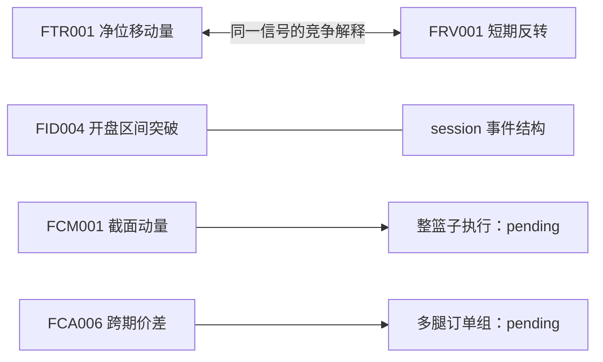

# 当前 Card Demo 与 Factorlab v3 研究入口

本轮展示 5 张知识 Card，并以 5 个已实现日内注册、1 个日频注册和 2 条显式 pending 组合链路说明
“Idea → Feature → Strategy → Portfolio → Execution → Account”的边界。原 Card 的选择没有
使用回测收益，原 58 张 Card 继续保留在 Registry。

| Card | 展示职责 | Factorlab 当前关系 |
|---|---|---|
| FTR001 时序动量 | 标准化净位移与趋势解释 | 30min rolling 与交易日锚定两个日内注册 |
| FRV001 短期收益反转 | 极端位移后的反转解释 | 5min 日内注册；5 交易日日频注册 |
| FID004 开盘区间突破 | session 形成、事件结构和结构化风险 | day/night 两个日内注册；OR 另一侧保护位 |
| FCM001 商品截面动量 | 多品种排序与整篮子需求 | 本轮不执行；日频篮子仍 pending |
| FCA006 跨期价差动量 | 双腿、相对价值与残余腿风险 | 本轮不执行；近远月选择与订单组 pending |

“Primitive / Derived / Composite”是构造说明，不能被当成经济理论或策略执行的父子层级。
FTR001 在数学上比一些衍生趋势表示更原子，不代表它在经济学上更上层；关系类型见
[concept structure](../data/concept_structure_gpt5.6sol.json)。

## 第 3 部分与难度

| 策略入口 | 当前状态 | 难度 / 5 | 主要边界 |
|---|---|---:|---|
| FTR001 | 两个日内 v3 版本已执行 | 2 | closed-bar 信号、session 截止、真实合约与一手账户 |
| FRV001 | 5min 日内与 5 交易日日频版本已执行 | 3 | 同一机制跨时间尺度、零线退出、由 n 推导的期限 |
| FID004 | day/night v3 已执行 | 3 | OR 形成、同向一次、结构保护位和 session 退出 |
| FCM001 | 本轮未执行 | 4 | 同期截面对齐、重排、篮子目标与实际暴露 |
| FCA006 | 本轮未执行 | 5 | 近远月选择、非同步成交、残余腿清算和组级风险 |

所有已实现单腿路径都在当前 11 品种中各自按一手独立账户运行；这不等于已经实现共享账户、
截面篮子或双腿策略。当前研究池不含国债 T、SC 和 SA。
未来 Recipe 读取同一个策略配置和已选择的运行产物展示，不在 NaCl 写第二份 entry/exit/
风控参数。
