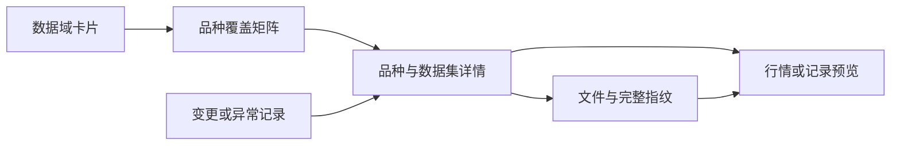

# Database Management — 数据档案库设计

版本：Design v1 · 2026-09-14  
适用工程：Recipe / SALT Research Terminal  
实施状态：Recipe V1 已按本设计接入数据总览、九类数据域、品种覆盖矩阵、Manifest 文件详情、可取消的单文件 SHA-256 核验，以及内嵌行情浏览器。salt-data 保持只读；观察结果保存在 Recipe 的 `.cache/database/`。

## 1. 核心想法

把 Database Management 做成 SALT 的**数据档案库**：用 Factor Tree 的卡片、层级与弹窗组织数据，用 Factor Results 的图表与详情布局检查证据。

进入时先回答三个问题：

1. 仓库有哪些数据，规模和覆盖范围如何？
2. 相对已发布的清单，哪些文件发生了变化、缺失或尚未核验？
3. 某个问题具体落在哪个品种、合约、时间和文件上？

默认画面是安静的立体档案陈列。鼠标靠近一个数据域，卡片轻微展开；点击打开聚焦详情。角色位于上方，光圈与角色整体漂浮。图表、文件证据、行情检查在同一个详情容器中切换，保留上下文。

**Market Data 收入行情数据域，顶栏只保留三个入口：**

```text
Database Management       Factor Tree       Factor Results
```

Database Management 作为默认首页。界面保留全站 Normal / English 切换，状态解释和弹窗正文也完整切换语言。

## 2. 现有数据基础：已经核实的情况

以下来自本次对 salt-data 的只读检查，是设计依据，不是新执行的整库完整性审计。数字代表当时的清单／Catalog 快照，实施时动态读取。

| 对象 | 当前观察 | 对设计的影响 |
|---|---|---|
| 数据根目录 | `/Users/kangbohang/Developer/salt-data`；运行时由 SaltCore 解析 | 不把机器绝对路径写死在前端 |
| `元数据/manifest/current_raw.parquet` | 37,418 条文件记录，均有 SHA-256；记录字节数合计 6,513,191,017 | 可以展示原始数据的登记规模、基线指纹和文件列表 |
| `元数据/manifest/current_derived.parquet` | 32,773 条文件记录，均有 SHA-256；记录字节数合计 8,186,108,368 | 可以展示派生数据的登记规模和指纹 |
| 两份当前 Manifest | 共 70,191 条；`business_start/end` 当前均为空 | “记录了 hash”可直接展示；日期范围不能从这些空字段推断 |
| 派生 Manifest 的结构字段 | 14,733 条记录缺少 `schema_columns` 与 `schema_hash` | 结构信息显示未知，按需读取文件元信息；不能默认结构一致 |
| `元数据/catalog.duckdb` | 存在 `catalog-v2`；当前 revision 为 `20260909T124611+0800-rederive-24e914ad` | 直接读取现有逻辑视图，保留 revision 与构建时间 |
| `v_products` / `v_exchanges` | 100 个品种目录，6 个交易所；93 active、7 retired | 全库总览包含在市和退市品种，退市不等于异常 |
| `v_market_series` | 26,824 条逻辑行情序列，部分时间范围缺失 | 文件数、合约数、逻辑序列数分别命名；不能混用 |
| `v_dataset_availability` | 1,000 条“品种 × 数据集”记录 | 可以直接做存在性矩阵；`available` 不代表历史无缺口 |
| `v_quality_events` / `v_quality_product_summary` | 当前均为 0 行 | 显示“尚无已索引的质量结果”，不能显示“零异常” |
| `元数据/runs/` | 有 batch、checks、derive report 等文件 | 可展示已有发布历史与对应范围的检查结果 |
| `元数据/manifest/history/` | 本次未发现历史快照 | 默认不展示虚构的历史完整性趋势；批次变更仅代表其记录范围 |
| `行情数据一致性审计/` | 有三层行情审计报告；旧 `00_总结.md` 明确是历史口径 | 报告按版本与范围展示，旧汇总不作为当前通过结论 |
| `实时行情接口/` | 有代码；metadata、reports、parquet、wal 当前为空 | 只显示目录存在及暂无记录，不能据此显示连接中或实时健康 |

两个需要明确的边界：

- 登记文件的字节数合计约 **14.70 GB**，这是 Manifest 范围内的逻辑文件大小，未包含全部备份、代码、报告、WAL 等，也不等于磁盘实际占用。
- 现有 `schema_hash` 实现主要对列名序列生成指纹，不足以证明字段类型、精度、可空性全部一致。页面称它为“列名指纹”，完整结构核验另标证据来源。

## 3. 首页如何呈现

### 3.1 第一屏线框

```text
┌──────────────────────────────────────────────────────────────────────┐
│ SALT      Database Management   Factor Tree   Factor Results   English│
├──────────────────────────────────────────────────────────────────────┤
│ salt-data / DATA ARCHIVE                      清单版本 · 观察时间      │
│ 数据档案库                                      [刷新观察] [核验…]   │
│                                                                      │
│ 登记文件数       登记规模       内容核验覆盖       需关注的文件          │
│ 实际数值         GB / GiB       已核验 / 应核验    异常 · 待核验        │
│                                                                      │
│                           NaCl 角色                                  │
│                       轻微漂浮与同步光圈                             │
│                                                                      │
│       行情数据              合约信息              品种配置            │
│       [数据档案卡]          [数据档案卡]          [数据档案卡]          │
│       仓单库存              持仓排名              现货价格            │
│       [数据档案卡]          [数据档案卡]          [数据档案卡]          │
│       涨跌停价格            主力合约映射          结算参数            │
│       [数据档案卡]          [数据档案卡]          [数据档案卡]          │
│                                                                      │
│ [品种覆盖]                                    [最近发布 / 变更]       │
│ 交易所 × 品种 × 数据集                         来源明确的时间线       │
└──────────────────────────────────────────────────────────────────────┘
```

页面可以自然向下滚动。首屏保留身份、状态摘要和主要卡片；覆盖矩阵与变更时间线在下方，不把所有表格挤进首屏。

### 3.2 九个数据域

| 中文名称 | 英文名称 | 对应 salt-data 对象 |
|---|---|---|
| 行情数据 | Market Data | 主连 1min、主连 daily、全部合约 1min、全部合约 daily |
| 合约信息 | Contract Reference | `contract_info`、`v_contract_master`、`v_contract_sources`、品种合约信息 |
| 品种配置 | Product Configuration | `product_config`、`v_product_configs` |
| 仓单库存 | Warehouse Receipts | `warehouse_receipts` |
| 持仓排名 | Position Rankings | `daily_positions` |
| 现货价格 | Spot Prices | `spot_daily` |
| 涨跌停价格 | Price Limits | `price_limits` |
| 主力合约映射 | Main-contract Mapping | `main_contract_map` |
| 结算参数 | Settlement Parameters | `daily_settlement` |

这九类是面向使用者的逻辑分类。原始／派生／元数据作为卡片内的来源层级和统计维度，不重复摆成另一组同义卡片。

**元数据与索引**通过顶部“清单版本”和角色打开：展示 Catalog、Manifest、发布批次与检查记录。它们是观察依据，不能因为没有把自己列入 Manifest 就被算成丢失文件。

### 3.3 卡片上的信息

静止时只显示：数据域名称、已登记文件数、覆盖品种数、状态分段线。存在可信时间范围时显示数据截止日期，否则显示“范围未记录”。

悬停时展开短预览，例如：

```text
MARKET DATA
行情数据

主连 1min       已登记 / 时间范围部分未知
主连 daily      已登记
全部合约 1min   已登记
全部合约 daily  已登记

查看覆盖与行情 ↗
```

所有数量来自当前快照。文件很多只影响计数，不让大数据域占满整个画面；卡片大小保持一致。

点击卡片经过短暂抬起、翻面动画进入详情。鼠标离开卡片区域后预览收起。背景只保留轻微景深和光效，状态字与数字始终清晰。

角色的点击行为固定为“打开清单与校验证据”。悬停和装饰动画不启动任何扫描任务。

## 4. 视觉语言

延续现有暗底、低饱和绿色、细边框和等宽代号；背景光效克制，数据层的对比度高于装饰层。

| 用途 | 建议色值 | 语义 |
|---|---|---|
| 页面底色 | `#080F13` | 与 Factor Tree 保持一致 |
| 卡片／图表面板 | `#0D191B`、`#101D20` | 保留轻微冷绿色层次 |
| 主文字 | `#E0E7DC` | 标题与关键数字 |
| 辅助文字 | `#758581` | 次要日期、来源、说明 |
| 已核验且与基线一致 | `#B9EF9F` | 轻微绿色发光 |
| 已登记／观察中 | `#75C9D3` | 青色细边，不冒充核验通过 |
| 待复核／信息不足 | `#D8C480` | 暖色边线与状态图标 |
| 不一致／文件缺失 | `#D88398` | 稳定的红色标记，避免持续闪烁 |
| 未监控／无记录 | `#52615A` | 灰色、空心或斜线纹理 |

状态同时使用文字和图形，不仅靠颜色。绿色发光必须有对应版本的内容核验证据。动画不作为状态依据。

卡片翻面约 250–350ms；悬停反馈尽量在一帧内开始。减少动态效果开启时关闭漂浮、翻转和粒子运动。首版优先 CSS／SVG，不新增 3D 引擎。

## 5. 详情是一张可放大的档案卡

桌面端使用居中的大弹窗，约视窗宽度 86%，最大 1,480px、高度不超过 92vh；小屏改为全屏详情。始终保留返回、关闭和面包屑。

```text
数据档案库 / 行情数据 / SHFE.AU                         [放大] [×]
概览       文件与指纹       覆盖与审计       行情
──────────────────────────────────────────────────────────────
当前选中对象、来源版本、观察时间

主要可视化 / 文件证据 / 嵌入行情浏览器

少量摘要与来源引用
```

只有行情数据域显示“行情”标签；其他数据域使用小型表格预览，按需读取有限行。每次只存在一个详情容器，内部跳转替换内容，保留返回历史。

建议的联动路径：



异常记录进入详情时，自动带上品种、数据集、合约与已知时间。关闭详情返回原来的卡片位置、矩阵滚动位置和筛选状态。

## 6. 三种检查分别表达

### 6.1 清单与索引

展示登记文件、记录的 SHA-256、行数、文件大小、Catalog revision 与构建时间。

“hash 登记覆盖率”定义为：

```text
有有效完整 SHA-256 的清单文件数 / 当前范围内全部清单文件数
```

本次快照可以得到 70,191 / 70,191，但这只表示基线有 hash。首页第一次加载时的内容核验仍应显示“尚未执行／无对应证据”。

Catalog 是 Manifest 的索引投影，不是第二份独立校验。必要时对比 Catalog 中的 raw／derived manifest 投影与当前两份 Manifest 的路径、hash、大小，检查索引是否落后。

### 6.2 当前文件与清单是否一致

| 状态 | 判定依据 | 展示方式 |
|---|---|---|
| 未核验 | 只有已记录的 hash，没有当前版本的实测结果 | 灰色或青色，标注“未核验” |
| 基础信息未变 | 存在性、大小、mtime 等检查通过，但本次未重新读内容 | “基础检查一致”；不计入本次内容核验通过数 |
| 内容一致 | 读取当前文件，SHA-256 与所选清单一致，读取期间未变更 | 绿色；显示核验时间、范围和版本 |
| 待复核 | 文件属性变化，或缓存已失效，还未完成内容复核 | 暖色 |
| 内容不一致 | 在稳定文件与稳定清单上复核，hash 不一致 | 红色，显示 expected / observed |
| 文件缺失 | 当前基线声明存在，稳定观察时实际不存在 | 红色；与“该品种从未登记此数据集”分开 |
| 读取失败 | 权限、格式、路径或 I/O 问题导致无法判断 | 错误状态，保留原因；不归成 hash 不一致 |
| 发布中 | 检查期间发布批次、清单或目标文件变化 | 暂不下结论，等待稳定快照后重试 |

文件在磁盘上存在但未进 Manifest，只有执行过指定范围的目录对账后才能标为“未登记”。没有扫描过的目录，不显示未登记数量为零。

**不设置单一“健康分数”。** 以“内容已核验／待核验／异常”和明确分母表达状态；内容核验同时展示文件数覆盖与字节数覆盖，避免大量小文件掩盖尚未检查的大文件。

### 6.3 数据覆盖与业务一致性

覆盖和质量检查使用 salt-data 现有记录、时段／生命周期参考和审计报告，独立于文件 hash。

- 文件 hash 一致，仍可能原本就缺分钟或包含源数据差异。
- `available` 只说明有登记数据，不能改名为“历史完整”。
- 只有起止日期时，绘制“已知范围”的轮廓，不把范围内部全部涂满。
- 真实日期／分钟密度图只使用已计算的分桶结果；尚未读取时显示未知。
- 没有交易日历、时段和上市／退市范围支撑时，不把周末、夜盘间隔或合约上市前时段判为缺口。
- 零成交量、平 OHLC、分钟聚合与供应商日线差异分别展示，不直接合并为损坏文件。

三层行情报告保持原有分工：合约分钟→合约日线、主力表选约→主连分钟、主力表选约→主连日线。每份报告显示生成时间、范围、方法和来源。无法绑定当前数据版本的报告显示“历史参考”，不能点亮当前核验状态。

## 7. Hash 的使用方式

文件详情展示完整 SHA-256，并提供复制。卡片上可以缩写为前后各 6–8 位，但比较与缓存键使用完整值。

建议字段：

```text
对象：SHFE.AU / market.main.daily
文件：派生数据/…/daily/…parquet
基线 SHA-256：完整值
实测 SHA-256：未核验时为空
基线版本：所选 Manifest 身份
核验时间：实际核验结束时间
结果：未核验 / 一致 / 不一致 / 发布中
```

保留三类身份，避免混用：

1. **稳定对象键**：`product_id + dataset_key + series_kind + frequency + contract_code`。用于选择、返回和链接。当前 Catalog 的 `series_id` 包含内容 hash，更新后会变化，因此不能单独作为长期书签。
2. **源端版本**：原样展示 `catalog_revision`、`content_revision`、`config_revision`。它们不都等价于完整文件 SHA-256；当前 `content_revision` 为组合指纹的截断值。
3. **观察快照身份**：绑定读取到的 Manifest／Catalog 版本及文件核验结果，避免跨批次拼接成“全通过”。

若需要首页短指纹，可生成带算法版本的“清单指纹”：对 `(kind, relative_path, size_bytes, expected_sha256)` 按固定顺序排序，用明确的 UTF-8 JSON 序列化后计算 SHA-256。路径使用根目录相对路径、统一 `/` 分隔，不包含机器绝对路径。

这是登记内容的组合指纹，不是重新读取全部数据后得出的根校验结果。首版可先只展示源端 revision，不必为了装饰新增这层计算。

哈希检查证明相对所选基线的一致性；它不证明供应商数据的业务正确性，也不提供独立于本地仓库的可信签名。

## 8. 品种覆盖矩阵与变更时间线

### 8.1 覆盖矩阵

行按交易所展开品种，列为当前 Catalog 的 10 个业务数据集；合约参考和品种配置在旁边作为独立状态列。默认显示全库，保留退市品种标记。

单元格表达“有登记／无登记／未知”，以边框或角标叠加核验、报告状态。鼠标悬停显示行数、序列数、已知范围、版本；点击打开该对象。

“有数据的品种比例”以 Catalog 中的品种为分母；“历史时间覆盖率”必须另有有效期间与应有交易时段。不可把不存在现货数据的金融品种自动当作缺失，应区分无记录、明确不适用和无法判断。

没有足够的来源规则时，保留“无记录”，不由前端猜测不适用。

### 8.2 最近发布与变更

时间线读取 `元数据/runs/**/batch.json`、checks 和 derive report，显示新增、替换、无变化、待审核、失败及发布状态。相同 run 的父／子批次按身份合并，避免重复计数。

只在某批次明确记录的文件范围内统计 `old_sha256 → new_sha256`。合法发布后的新 hash 属于版本变化；当前文件与该版本的预期 hash 不一致才属于完整性异常。

首页可显示最近几次发布，点击后查看该批次涉及的数据域、品种和文件。没有 Manifest 历史快照时，完整快照比较显示不可用，批次记录仍可阅读；不补造每日历史健康曲线。

## 9. Market Data 如何嵌入

现有 Market 的 K 线、多合约、分钟分页和键盘游标全部复用，作为 `MarketInspector` 放入“行情数据”详情的行情标签。

入口有三个：

- 点击行情数据卡片，再选择品种／主连／具体合约。
- 点击覆盖矩阵的某个行情单元格，直接继承该品种和频率。
- 点击异常或变更记录，从记录给出的对象与时间进入。

嵌入后保留：

- 主连与实际合约下拉多选；多个品种、多个合约可以并排显示。
- 完整历史日线；点击 bar 进入对应时间附近的 1min。
- 缩放、拖动、触控板、OHLCV 反馈、左右键游标。
- 分钟状态按 Esc 先返回原 daily；daily 状态再按 Esc 退出全屏／关闭详情，逐层处理。
- 详情展开期间继续使用单一图表实例，保留已加载窗口；不重复挂载全历史数据。

**品种来源需要调整：** 当前 Recipe 的 `market.py` 从 Factorlab research11 限定 11 个品种。数据库页覆盖的是 salt-data 全库，应改为从 `v_products`、`v_market_series` 和已发布数据发现可用对象，并验证所选文件。原 research11 不再充当数据库范围的白名单；是否做过回测不影响数据能否被检查。

默认继承选中对象，避免用户重复选品种。原独立 Market Data 顶栏按钮移除；已保存的老页面入口若后续存在路由，重定向到数据库的行情详情。

行情查询仍通过 SaltCore 的统一读取能力。遇到 Catalog 中时间范围或字段映射缺失，先显示索引信息不全；只有 SaltCore 确实支持读取的对象才提供可操作的行情入口，不能把“有序列登记”当成读取成功。

## 10. 全部事实来自 salt-data

| 展示内容 | 首选来源 | 证据不足时 |
|---|---|---|
| 交易所、品种、退市标记 | `v_exchanges`、`v_products` | 标记 Catalog 不可用／未知 |
| 文件、基线 SHA-256、大小、行数 | 两份当前 Manifest；Catalog 文件视图用于逻辑关联 | 不假造文件基线 |
| 逻辑序列、合约、存储定位 | `v_market_series` | 通过已有 SaltCore 能力验证是否可读取 |
| 数据集存在性 | `v_dataset_availability` | 保留 not_recorded 与 unknown |
| 品种配置及来源版本 | `v_product_configs`、对应配置 JSON | 证据链接为空，不推断来源 |
| 合约参考与生命周期 | `v_contract_master`、`v_contract_sources`、`v_contract_lifecycle` | 不从合约代码猜完整生命周期 |
| 发布／检查状态 | batch、checks、derive report | 提示缺少该阶段记录 |
| 质量结论 | 质量视图及带来源信息的三层审计报告 | 显示尚未索引／历史参考 |
| 当前内容 hash、存在性和有限行预览 | 对 salt-data 文件的只读观察 | 记录失败原因与观察范围 |

Database Management 的仓库事实不依赖 NaCl 或 Factorlab，也不请求供应商、网络行情或外部数据库。沿用它们的视觉与交互组件即可。

代码、环境、日志、回滚副本、文档以及实时接口目录不默认计入“已登记业务数据”的分母。在“监控范围”中列明纳入与未纳入部分，未来如需监控代码或报告，应另设基线范围。

首版不执行全库 hash 重算；内容校验由用户在详情中对单个登记文件明确触发。页面不提供 salt-data 的 `scan`、`apply-batch`、发布、修复、回滚或删除操作。

## 11. 轻量实现方式

### 11.1 前端复用

```text
Database.tsx
  ├─ 数据域卡片与概览
  ├─ 覆盖矩阵与变更摘要
  └─ DatabaseDetail
       ├─ 文件、指纹、来源与审计
       └─ MarketInspector（提取现有 Market 的行情浏览主体）
```

复用 Keeper、Sigil、弹窗容器、图表操作和语言机制；不为数据库另外维护一套颜色、角色或弹窗栈。第一版只有卡片总览这一种主布局。

若之后需要图谱，可增加“数据域 → 交易所 → 品种 → 数据集 → 文件”的自上而下结构视图，与卡片共享对象键。每层按需展开，文件列表虚拟化；目录关系与有证据的输入／输出关系使用不同连线。没有来源关联时不绘制血缘。

图谱属于后续增强，不影响首版监控功能交付。

### 11.2 后端边界

Recipe 增加一个小型 `database.py` 只读适配层，读取现有 Catalog、Manifest、批次文件并归一化前端需要的字段。规则与派生逻辑仍留在 salt-data；行情读取仍复用 SaltCore。

建议接口，均为拟议契约：

```text
GET  /api/database/overview
GET  /api/database/objects?domain=market&product=SHFE.AU
GET  /api/database/files?object_key=…&cursor=…
GET  /api/database/changes?run_id=…
POST /api/database/observations       # 创建范围明确的只读检查任务
GET  /api/database/observations/{id}  # 进度、范围与结果
```

`/api/bars` 与 `/api/contracts` 保留并移除 Factorlab 范围依赖。首版不把任意路径或任意 SQL 暴露给前端；后端将逻辑对象映射到根目录内、已登记的目标。

观察结果示意：

```json
{
  "object_key": "SHFE.AU|market.main.daily|main_continuous|daily|",
  "catalog_revision": "源端版本",
  "manifest_identity": "本次绑定的清单身份",
  "registration": "recorded",
  "integrity": "unverified",
  "quality": "not_assessed",
  "expected_sha256": "单文件时填写完整值",
  "observed_sha256": null,
  "checked_at": null,
  "scope": {"expected_files": 10, "checked_files": 0},
  "evidence": []
}
```

上面的数值仅为结构示意，不是当前 AU 的统计；聚合对象保留文件级结果列表，不能把多个文件伪装成一个文件 hash。

### 11.3 检查策略

默认打开页面只读取小型元数据和已有观察缓存；查看详情后再加载文件列表、必要的元信息与预览。

“刷新观察”刷新源端元数据并排队做基础文件检查。“核验…”选择当前对象或全部纳入范围，明确文件数和总字节数后开始内容读取；提供进度与取消，不靠悬停触发。

初始目录／存在性检查分批执行，避免 70,191 次 stat 阻塞首屏。hash 校验低并发、流式读取，按范围去重；当前行情查询优先于后台大文件校验。打开页面不自动重算全库 hash。

size／mtime 只能用于挑选需要优先复核的对象；即使两者未变也不能证明内容未变。完整内容校验必须实际读取所选范围；增量检查结果保留“本轮检查／沿用历史证据”的区别。

观察缓存可写在 Recipe 的 `.cache/database/`，只保存元数据、进度和结果；不复制行情文件，也不成为第二份发布基线。salt-data 保持只读。

### 11.4 发布期间的一致性

一次观察绑定明确的 Manifest／Catalog 快照。若原始清单、派生清单与 Catalog 的读取身份不稳定，展示“更新中”，避免汇总混合版本。

单文件核验前后检查文件身份、大小与时间属性，结合读取句柄及路径是否已被替换判断是否稳定；发布期间变化的结果作废并重试。hash 不一致且源快照稳定后才形成异常记录。

成功发布的新基线让旧观察缓存失效；Recipe 不自动把观察到的新 hash 写回 Manifest。检查结果过期时保留历史时间，但不继续当作当前通过。

## 12. 几个具体使用场景

**查看 AU 的数据是否可用。** 打开行情卡片 → 点击 SHFE.AU → 看四类行情登记、范围和核验状态 → 打开行情标签。选中 AU 主连和两个实际合约并排检查；从 daily 钻取 minute 后 Esc 返回原视野。

**排查一个缺失文件。** 基础检查发现 Manifest 登记的文件不存在 → 对应卡片出现红色计数 → 点击进入精确文件详情 → 查看预期 hash、最后发布批次、当前观察时间。页面提供证据，不在浏览时自动修复数据。

**确认正常日更。** 时间线出现已发布批次，记录 old／new hash → 对应对象显示新版本待核验 → 内容检查匹配新基线后转绿。正常更新不被标成损坏。

**已有 hash 但没有检查过。** 首次打开显示基线 hash 完整、内容检查尚未执行；卡片保持青色／灰色。已有报告可以查看，但不被说成刚完成的全库核验。

**存在文件但范围未知。** Catalog 的序列存在，min／max 为空 → 覆盖矩阵显示“有登记，范围未知” → 用户打开该对象后，成功读取的范围可作为新的只读观察；不覆盖源端 Catalog。

## 13. 首版范围与验收

首版完成：顶栏替换、九类数据卡片、全库品种覆盖、文件与 hash 详情、基础／内容检查、已有批次变更阅读、嵌入行情、全英文模式。

后续再考虑目录图谱、定期校验调度、跨快照差异趋势和更详细的时间密度图；前提是有对应源数据、历史快照或实际检查记录。

验收标准：

1. 首页与 salt-data 当前清单／Catalog 的登记计数对得上，每个指标有范围、来源版本与时间。
2. 只有记录 hash 的文件不会被标成“本轮内容通过”；质量表为空不会显示零异常。
3. 在测试夹具中模拟缺失、内容变化、无权限、发布替换，状态区分正确；只改内容且保持大小／mtime 时，完整 hash 核验仍能发现变化。
4. 合法发布后按新基线检查；检查过程中版本变化不会形成错误的红色或绿色结论。
5. 合约、文件和逻辑序列数量分开，未纳入目录和历史备份不混入业务数据分母。
6. 点击卡片、矩阵、变更记录都能进入同一个正确对象，关闭后恢复原上下文。
7. Market 独立导航消失；行情详情覆盖 salt-data 实际可读品种，支持跨品种／合约多选和 daily ↔ minute 返回。
8. 大文件检查不阻塞图表；取消只停止任务，不留下对源数据的修改。
9. 缺少历史、日期范围、结构信息或质量报告时，展示未知及其原因。
10. 新增完整性测试使用临时文件夹具；不以修改真实 salt-data 来测试损坏场景。

## 14. 参考来源

- [salt-data 总体边界与流程](../../../salt-data/README.md)
- [Manifest 字段、扫描范围与 hash 实现](../../../salt-data/代码/src/salt_data/manifest.py)
- [Catalog 视图、版本与逻辑序列实现](../../../salt-data/代码/src/salt_data/catalog.py)
- [自动化运行与发布说明](../../../salt-data/代码/docs/自动化运行总说明.md)
- [三层行情审计的定义](../../../salt-data/行情数据一致性审计/README.md)
- [当前统计报告](../../../salt-data/派生数据/文档/当前统计报告.md)
- [当前原始文件 Manifest](../../../salt-data/元数据/manifest/current_raw.parquet)
- [当前派生文件 Manifest](../../../salt-data/元数据/manifest/current_derived.parquet)
- [Recipe 当前行情接口](../src/recipe/market.py)
- [Factor Tree 的视觉与交互样式](../frontend/src/components/idea-room/idea-room.css)
- [Factor Results 的卡片入口](../frontend/src/components/FactorCollection.tsx)
